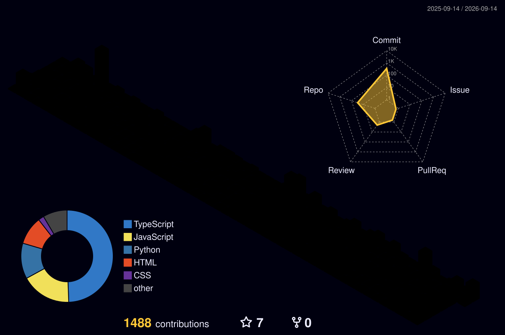

<!-- ░▒▓ AYXN07 // PROFILE v2026.09 ▓▒░ -->

<a href="https://portfolio.ayxn07.com">
  
</a>

<a href="https://ayxn07.com">
  
</a>

<p align="center">
  <a href="https://ayxn07.com">
     booting ayxn07.exe" />
  </a>
</p>

<p align="center">
  <a href="#whoami"></a>
  <a href="#projects"></a>
  <a href="#stack"></a>
  <a href="#telemetry"></a>
  <a href="#snake"></a>
</p>

<p align="center">
  
  
  
  
</p>

<a name="whoami"></a>


## `01` whoami

```ts
const ayaan = {
  name:      "Mohammed Ayaan Khan",
  handle:    "@ayxn07",
  location:  "Dubai, UAE",
  education: "Computer Science @ University of Wollongong in Dubai — major: AI & Big Data",
  role:      "Full-stack developer who ships the whole thing: pixels → API → edge",

  currentlyBuilding: [
    "Ayxn Studio — free AI image & video studio with a from-scratch node editor",
    "AI agents + MCP servers wired into real tools",
    "Portfolio OS — a macOS desktop that runs in the browser",
  ],

  shipsWith: {
    web:     ["Next.js", "React", "TypeScript", "Tailwind", "Three.js"],
    mobile:  ["Flutter", "Expo / React Native", "Kotlin"],
    backend: ["Node.js", "Express", "Supabase", "Firebase", "MongoDB", "MySQL"],
    cloud:   ["Cloudflare", "AWS", "Netlify"],
    ai:      ["Python", "computer vision", "LLM agents", "MCP"],
    design:  ["Figma", "Blender", "After Effects", "Photoshop"],
  },

  certified: ["Full-Stack Development", "Flutter App Development"],
  motto:     "If I have to do it twice, I build a tool for it.",
};
```

<a name="projects"></a>


## `02` projects

> [!TIP]
> Every card is clickable. Every section below expands and collapses.

<p align="center">
  <a href="https://studio.ayxn07.com"></a>
  <a href="https://github.com/ayxn07/soundify"></a>
  <a href="https://github.com/ayxn07/FaceAttend-System"></a>
  <a href="https://ayxn07.com"></a>
</p>

<details>
<summary><b>▸ more from the lab</b></summary>
<br />

| repo | what it does | stack |
| :-- | :-- | :-- |
| [`minecraft-clone-threejs`](https://github.com/ayxn07/minecraft-clone-threejs) | Browser voxel game with procedural worlds, block building, FPS combat, and drivable cars | Next.js · React 19 · Three.js |
| [`jarvis-agent`](https://github.com/ayxn07/jarvis-agent) | Multimodal assistant: streams Gemini, reads camera frames, speaks via ElevenLabs, logs every tool call live | TypeScript · Gemini · ElevenLabs |
| [`Movie-App-UI`](https://github.com/ayxn07/Movie-App-UI) | Sleek movie app UI | React Native · TypeScript |
| [`lib-management-sys`](https://github.com/ayxn07/lib-management-sys) | Library management: books, members, issuing and returns | Python |
| [`GitHub-Guide`](https://github.com/ayxn07/GitHub-Guide) | A GitHub cheat sheet | Markdown |

</details>

<a name="stack"></a>


## `03` stack

<details open>
<summary><code>~/stack/languages</code></summary>
<br />
<p align="center">
  
</p>
</details>

<details open>
<summary><code>~/stack/frontend</code></summary>
<br />
<p align="center">
  
  <br />
  
  
  
  
</p>
</details>

<details open>
<summary><code>~/stack/mobile</code></summary>
<br />
<p align="center">
  
  <br />
  
</p>
</details>

<details open>
<summary><code>~/stack/backend+data</code></summary>
<br />
<p align="center">
  
</p>
</details>

<details open>
<summary><code>~/stack/cloud+tooling</code></summary>
<br />
<p align="center">
  
</p>
</details>

<details open>
<summary><code>~/stack/design+motion</code></summary>
<br />
<p align="center">
  
  <br />
  
</p>
</details>

<a name="telemetry"></a>


## `04` telemetry

<p align="center">
  
</p>

<p align="center">
  
  
</p>

<details open>
<summary><code>~/telemetry/languages+rhythm</code></summary>
<br />
<p align="center">
  
  
  
</p>
</details>

<a name="snake"></a>


## `05` snake.exe

<p align="center">
  <picture>
    <source media="(prefers-color-scheme: dark)" srcset="https://raw.githubusercontent.com/ayxn07/Ayxn07/output/snake-neon.svg" />
    <source media="(prefers-color-scheme: light)" srcset="https://raw.githubusercontent.com/ayxn07/Ayxn07/output/snake-light.svg" />
    
  </picture>
</p>

<p align="center"><sub>regenerated daily from my real commits · every square it eats is a day I shipped</sub></p>


## `>_` connect

<p align="center">
  <a href="https://portfolio.ayxn07.com"></a>
  <a href="https://ayxn07.com"></a>
  <a href="https://linkedin.com/in/ayaan-khan-54738229b"></a>
  <a href="https://x.com/Ayxn07_"></a>
  <a href="https://instagram.com/Ayxn07_"></a>
  <a href="mailto:ayxn07dev@gmail.com"></a>
</p>


