<a href="https://portfolio.ayxn07.com">
  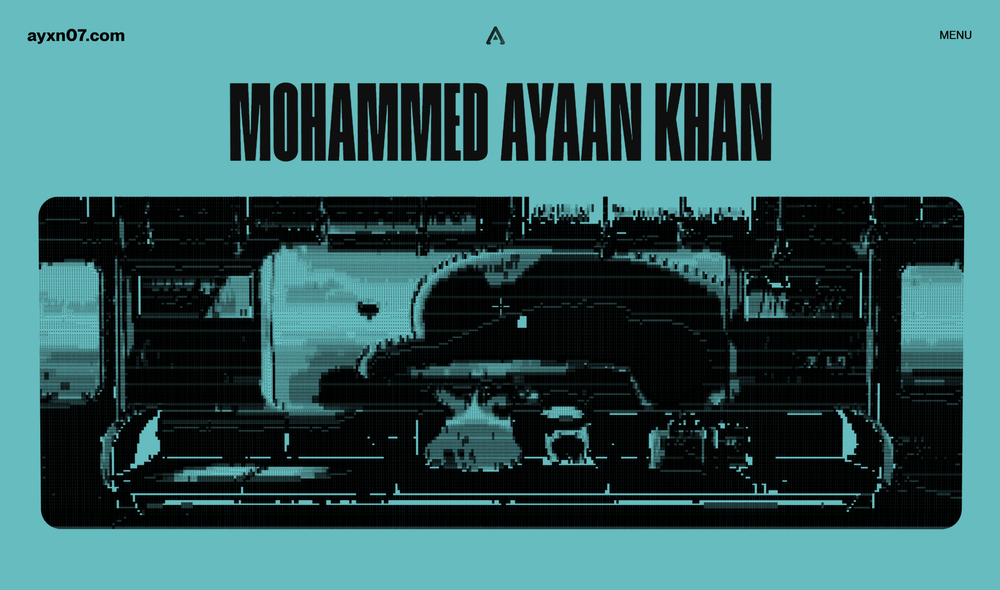
</a>

 building AI agents & MCP servers — status: building — Dubai, UAE — CS / AI & Big Data @ UOWD" />

  
  
  
  
  




  <a href="https://studio.ayxn07.com">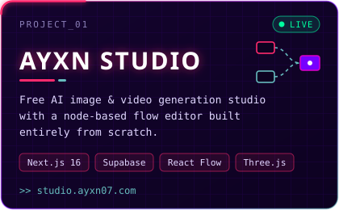</a>
  <a href="https://github.com/ayxn07/soundify">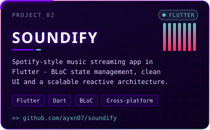</a>
  <a href="https://github.com/ayxn07/FaceAttend-System">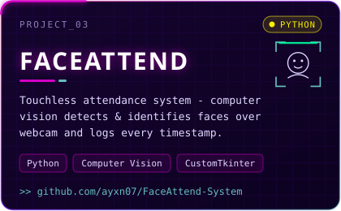</a>
  <a href="https://ayxn07.com"></a>

<b>more from the lab</b>

 

| repo | what it does | stack |
| :-- | :-- | :-- |
| [`minecraft-clone-threejs`](https://github.com/ayxn07/minecraft-clone-threejs) | Browser voxel game with procedural worlds, block building, FPS combat, and drivable cars | Next.js · React 19 · Three.js |
| [`jarvis-agent`](https://github.com/ayxn07/jarvis-agent) | Multimodal assistant: streams Gemini, reads camera frames, speaks via ElevenLabs, logs every tool call live | TypeScript · Gemini · ElevenLabs |
| [`Movie-App-UI`](https://github.com/ayxn07/Movie-App-UI) | Sleek movie app UI | React Native · TypeScript |
| [`lib-management-sys`](https://github.com/ayxn07/lib-management-sys) | Library management: books, members, issuing and returns | Python |
| [`GitHub-Guide`](https://github.com/ayxn07/GitHub-Guide) | A GitHub cheat sheet | Markdown |

<b>languages</b>

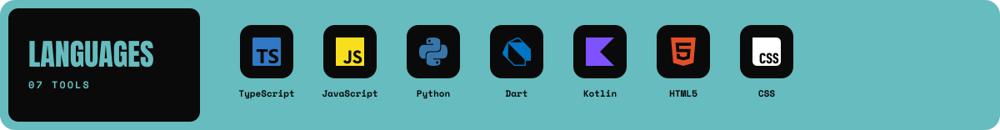

<b>frontend</b>

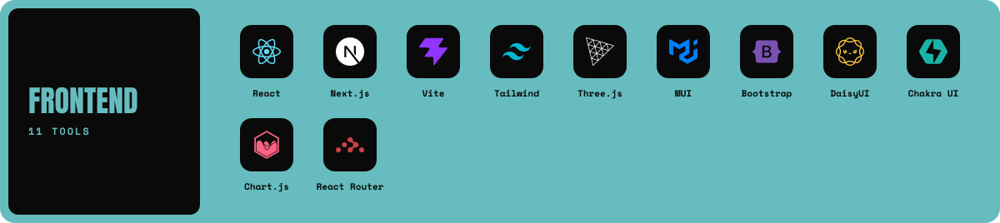

<b>mobile</b>

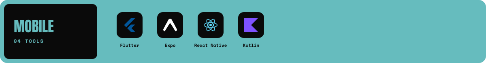

<b>backend & data</b>

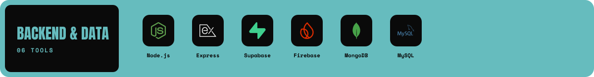

<b>cloud & tools</b>

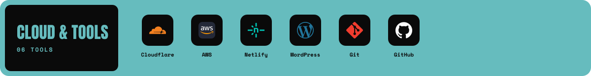

<b>design & motion</b>

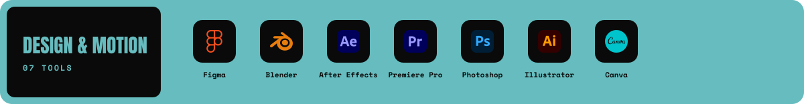


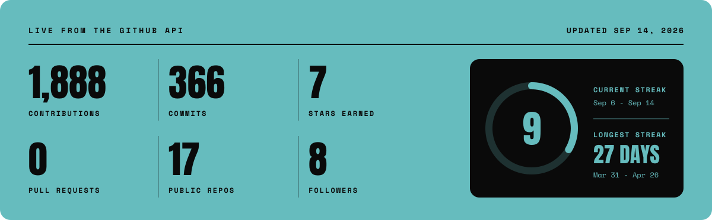

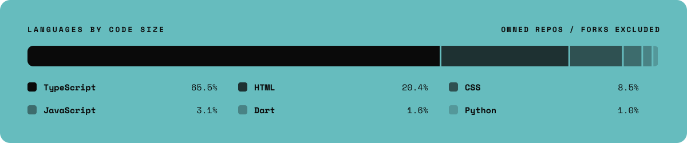



  
  
  
  
  

